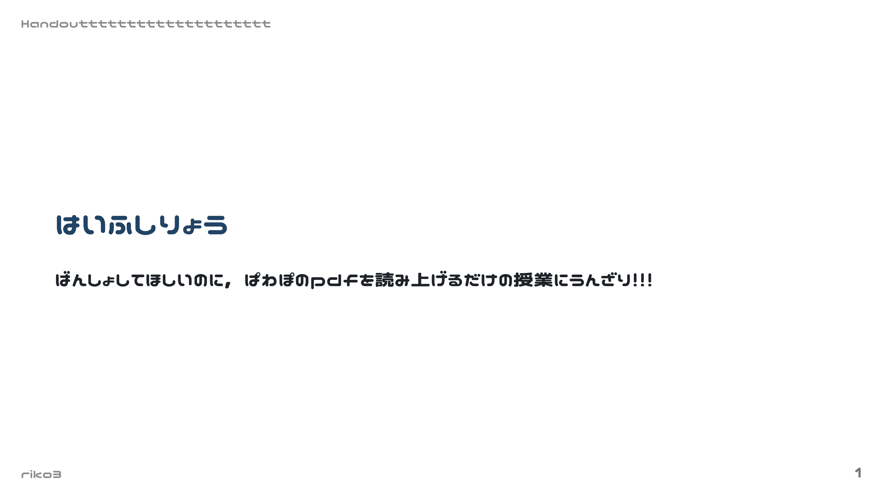
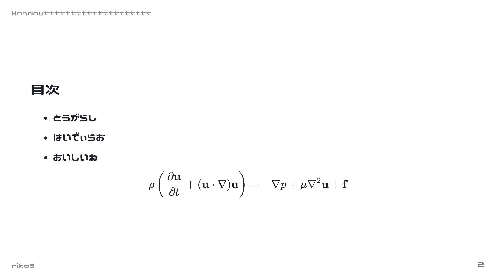
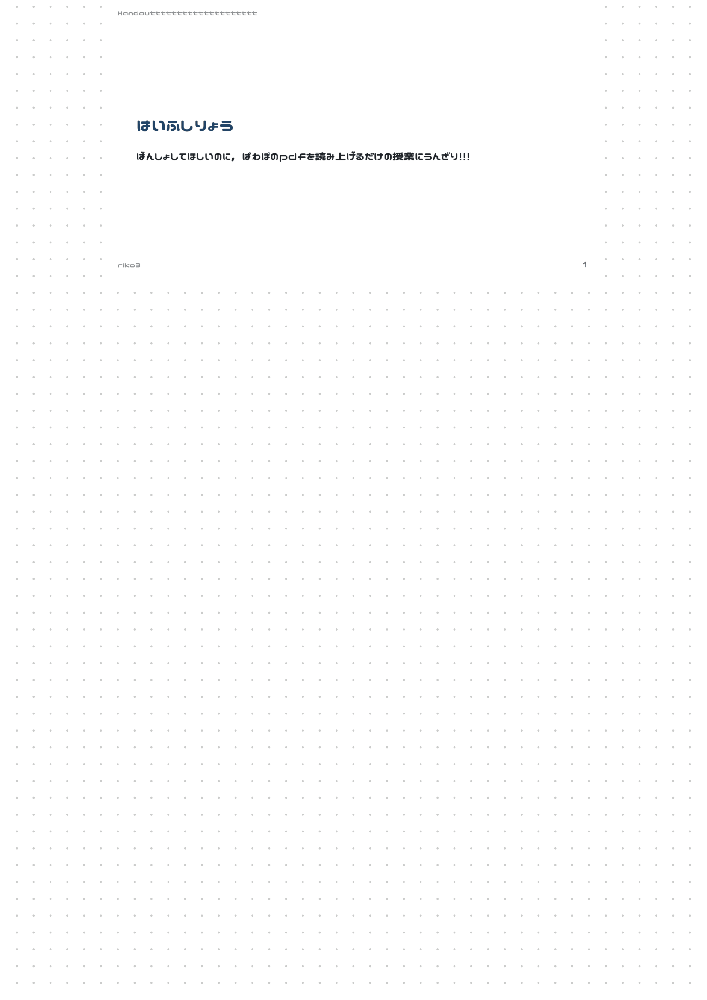
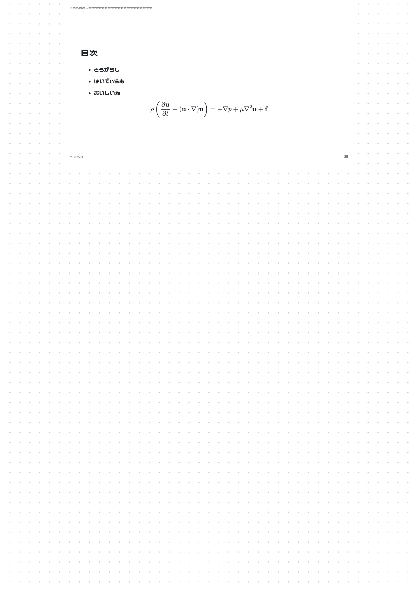
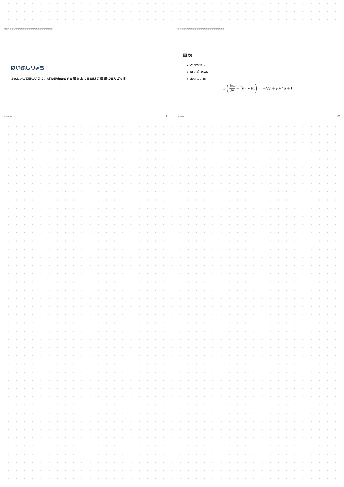

# ReadMe

## 目的

板書がされない講義を効率的に受講するためにはiPadが必要だがそんなお金はない．
そこでオンラインで配布された資料を自動で以下の形に整えるツールを作成した．

- 配布資料を70%に縮小してA4の上部に配置
- 下部にメモ用のドットをつける

## 使い方

- このフォルダに実行したいpdfファイルをresume.pdfという名前でペーストする
- `main○.py`を実行すると同じフォルダにoutput_with_notes.pdfが作成される
  - `main1.py`：1枚に配布資料1ページ
  - `main2.py`：1枚に配布資料2ページ

## こんな感じ

もともとのパワポの配布資料こんな感じだとする．
このまま印刷してもメモするところ少ないし，紙いっぱい消費しちゃう．

  
  

ここで，`main1.py`をやると以下のように

- 配布資料がpdf上部にいく
- ドットが追加される

  
  

あるいは，`main2.py`をやると一枚にまとめられる

